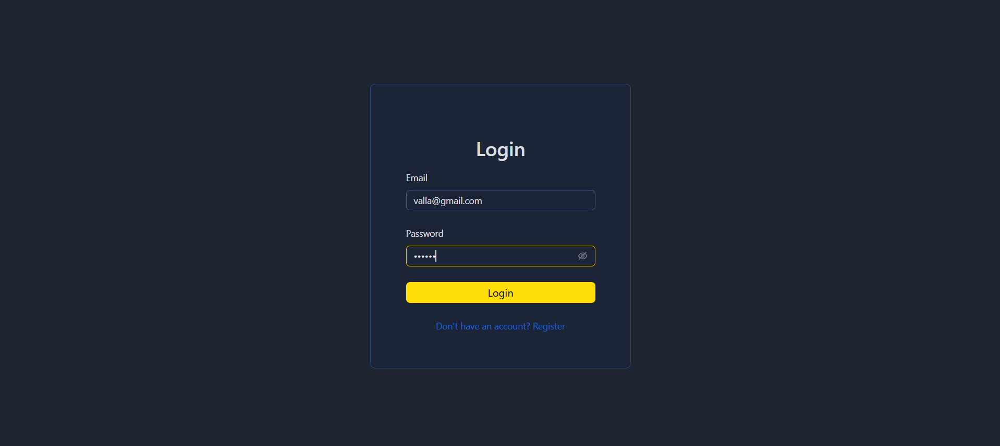
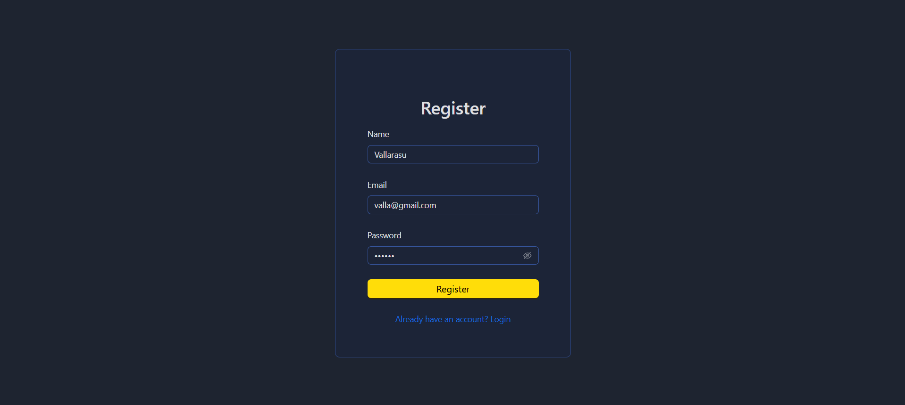
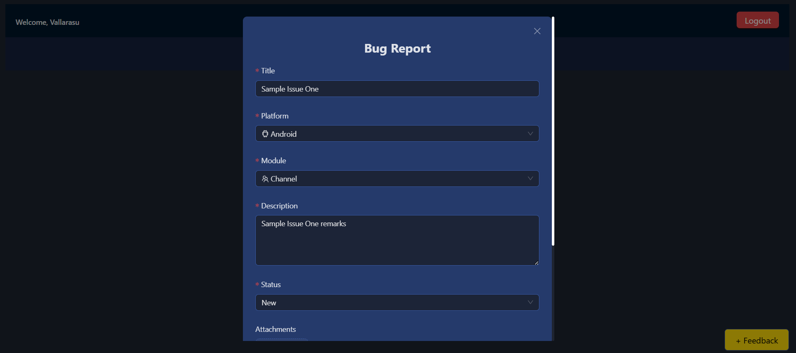
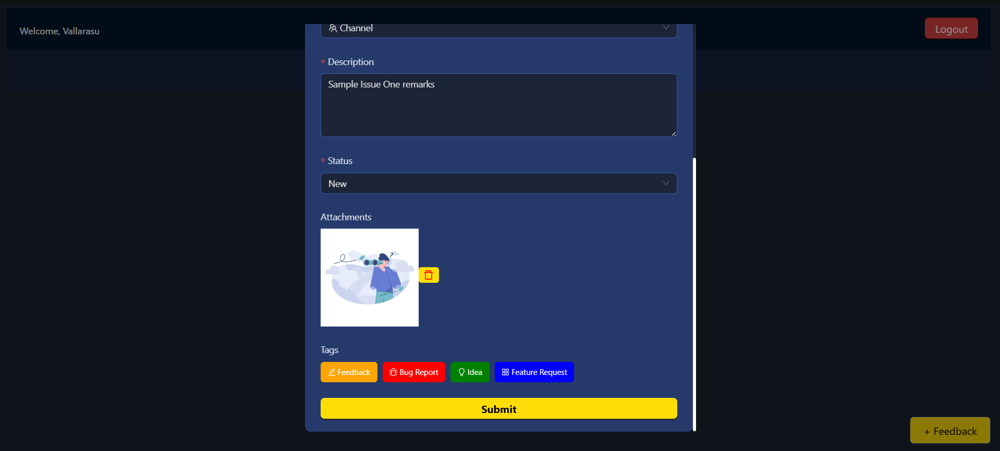
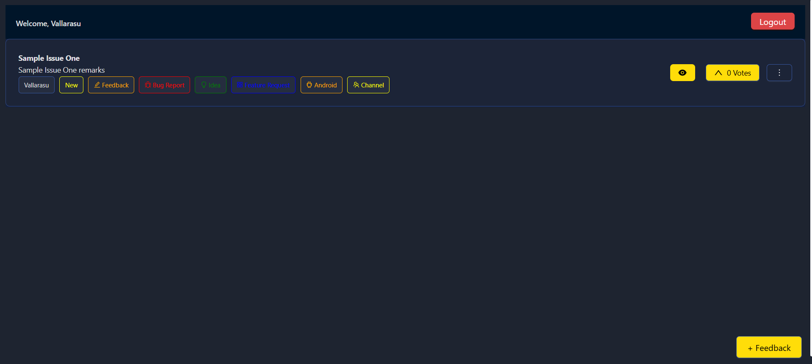
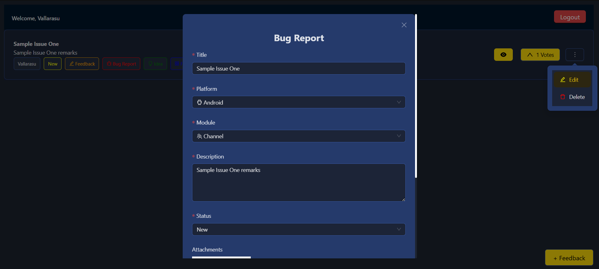
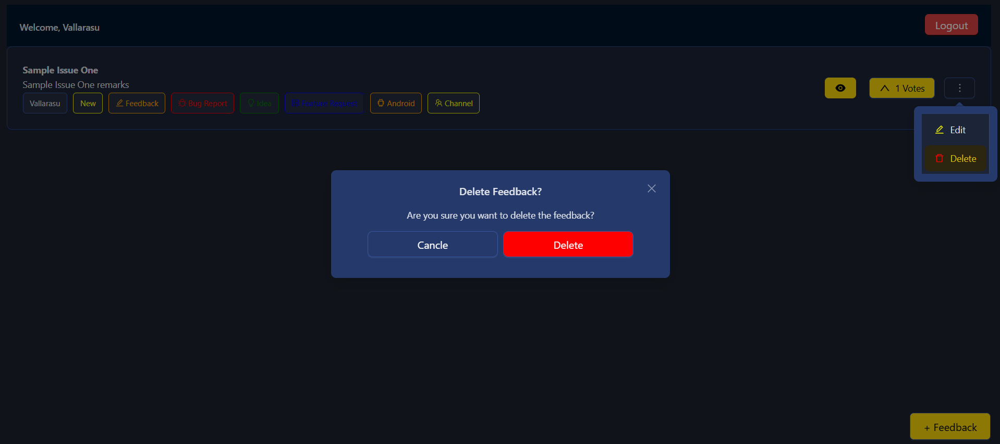
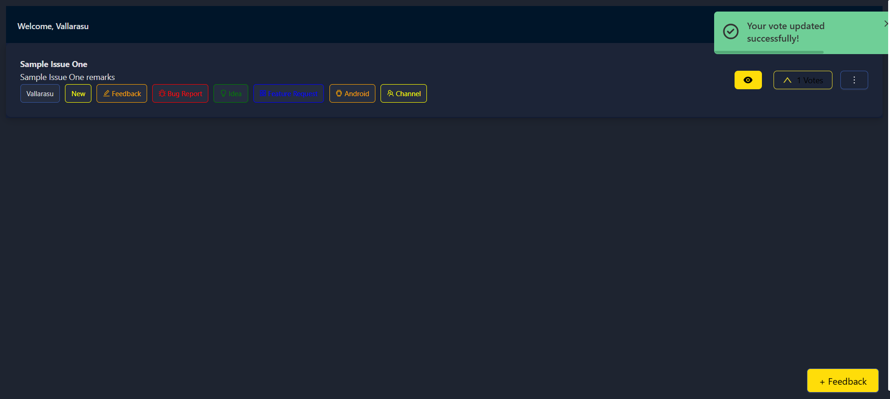
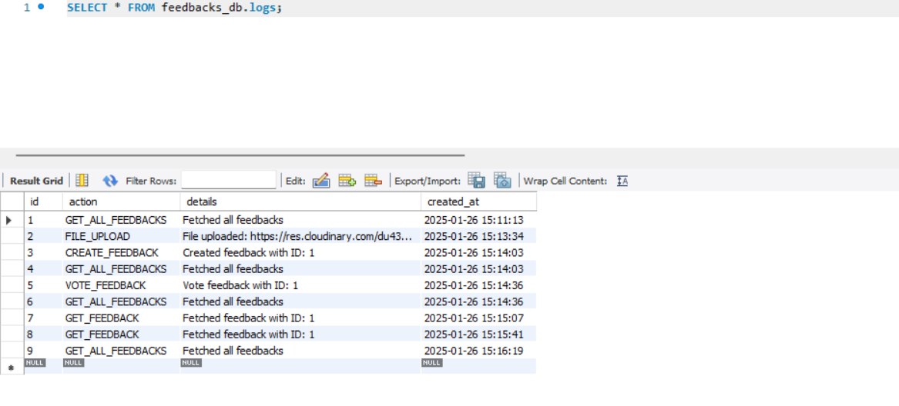
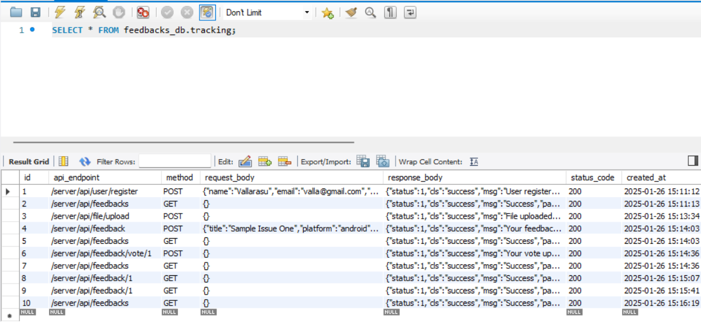

#### Simple Feedback Management System  (React JS, Node JS, MySQL)

#### Screenshots :

---

#### Project Setup  
1. **Front End (React JS)**  
   1. Run `npm install` to install the required packages.  
   2. Run `npm start` to launch the web application.  

2. **Back End (Node JS)**  
   1. Run `npm install` to install the required packages.  
   2. Run `npm start` to start the server.  

3. **Database Configuration:**  
   1. Create a new database in your SQL server (e.g., `feedbacks_db`).  
   2. Create the necessary tables using the `feedbacks_db.sql` file.  

